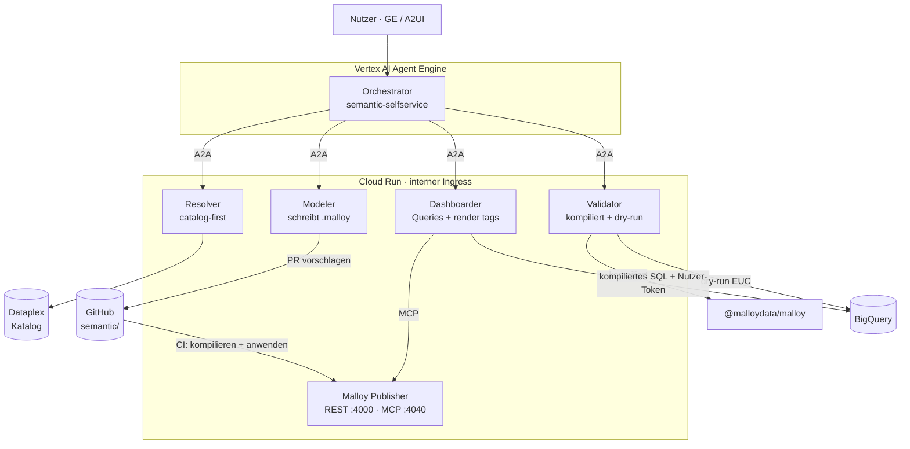
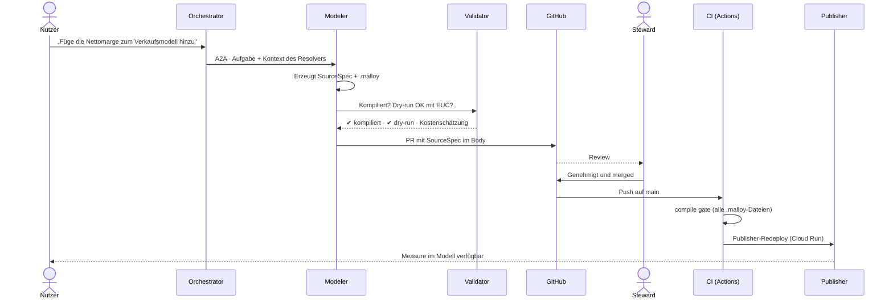
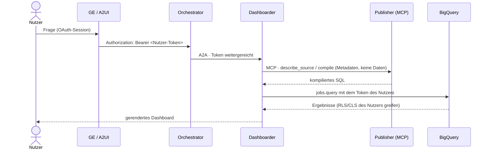

# semantic-selfservice-agents

[Español](README.md) · [English](README.en.md) · [Français](README.fr.md) · **Deutsch** · [Português](README.pt.md)

**Agenten-Trupp für Self-Service-BI mit [Malloy](https://github.com/malloydata/malloy) als semantischer Schicht, auf Google Cloud.**

Git-native Variante von [`bi-selfservice-agents`](https://github.com/joseimj/bi-selfservice-agents): dieselbe Rolle im Ökosystem (governte Daten → Dashboards), wobei Looker/LookML durch Malloy + Malloy Publisher ersetzt wird. Existiert neben [`bq-adhoc-agents`](https://github.com/joseimj/bq-adhoc-agents) (Long Tail → flüchtiges SQL) und [`ds-lab-agents`](https://github.com/joseimj/ds-lab-agents) (Inferenz und Vorhersage).

Gebaut mit **Google ADK**, bereitgestellt über **A2A** und **A2UI**, orchestriert von **Vertex AI Agent Engine**, mit Spezialisten auf **Cloud Run** (interner Ingress), Governance des semantischen Modells über das Muster **vorschlagen / genehmigen / anwenden** auf Git, und Ausführung mit der Identität des Endnutzers (**EUC**) durchgängig.

---

## 1. Warum es dieses Projekt gibt

| Trupp | Beantwortete Frage | Oberfläche |
|---|---|---|
| **`semantic-selfservice-agents`** | „Wie viel haben wir pro Region verkauft?" (governte, wiederkehrende Metrik) | Malloy-Dashboards (render tags), ausgeliefert von Publisher |
| `bq-adhoc-agents` | „Wie viele Bestellungen mit Coupon X im März?" (Long Tail, einmalig) | Flüchtiges SQL + Visualisierung |
| `ds-lab-agents` | „Welche Kunden kündigen und warum?" (Inferenz, Vorhersage) | Modelle + Scoring + Berichte |

Die These bleibt: **im Long Tail experimentieren, ins Governte graduieren**. Was sich ändert, ist, *wo* das Governte lebt: Statt einer Looker-Instanz mit eigener API und eigenem Zustand ist das semantische Modell eine Menge von `.malloy`-Dateien in diesem Repository. **Das Repository ist die vollständige Source of Truth** — es gibt keinen externen Zustand, der synchronisiert werden müsste.

### 1.1 Was sich gegenüber `bi-selfservice-agents` ändert

| Dimension | Looker (ursprüngliches Repo) | Malloy (dieses Repo) |
|---|---|---|
| Semantisches Modell | LookML (views/explores), mit der Instanz synchronisiert | `.malloy`-Dateien (sources/queries) — Git-nativ |
| Bereitstellung | Looker-Instanz + SDK 4.0 | Malloy Publisher auf Cloud Run (REST `:4000` + MCP `:4040`) |
| Dashboards | LookML dashboards / UDD via API | Eine Query mit `nest:` + render tags (`# dashboard`, `# bar_chart`) — ein einziges Text-Artefakt |
| Auslieferung an den Nutzer | Embed-SSO-URL | Publisher-UI, React-Komponenten des SDK oder `.malloynb`-Notebook |
| CI-Validierung | `lookml-lint` + Validator der Instanz | Deterministische Kompilierung (`@malloydata/malloy`) + BigQuery-dry-run |
| EUC | Token endet am Embed SSO | Kompiliertes SQL läuft auf BQ mit dem OAuth-Token des Nutzers — ein Hop weniger |
| Schnittstelle für Agenten | Looker SDK (REST) | **Natives MCP** von Publisher — Spezialisten befragen das Modell über MCP |
| Scheduling / Alerts | Nativ in Looker | Cloud Scheduler + `dashboarder`-Agent (siehe §9 Roadmap) |

### 1.2 Geerbte Prinzipien (nicht verhandelbar)

1. **Catalog-first**: Das LLM erinnert sich nie an Schemata; es befragt Dataplex. Tabellen, Dimensionen und Metriken werden gegen den Katalog aufgelöst, bevor irgendein `.malloy` erzeugt wird.
2. **Vorschlagen / genehmigen / anwenden**: Agenten schreiben nie direkt ins semantische Modell. Sie schlagen einen PR mit der neuen oder geänderten `.malloy` vor; ein menschlicher Steward genehmigt; die CI kompiliert und wendet an (Publisher-Redeploy).
3. **EUC durchgängig**: Jede Query läuft mit dem OAuth-Token des Endnutzers. Keine weitreichenden Service Accounts auf dem Datenpfad.
4. **Specs per Referenz**: Verträge zwischen Agenten transportieren URIs (Git-Pfade, Tabellen-FQNs, PR-IDs), nie Inline-Daten im Kontext.
5. **AgentCard als öffentlicher Vertrag**: Der Trupp veröffentlicht seine Fähigkeiten unter `/.well-known/agent-card.json`; der allgemeine Orchestrator (Hub) entdeckt ihn dort, nicht per Hardcoding.

---

## 2. Architektur




Das Detail, das alles zusammenhält: **Publisher berührt auf dem Pfad des Nutzers nie Daten mit eigenen Credentials**. Publisher kompiliert und liefert Modell-Metadaten (via MCP); die *Ausführung* des kompilierten SQL übernimmt der Spezialist gegen BigQuery mit dem OAuth-Token des Nutzers (striktes EUC). Die in Publisher konfigurierte BQ-Verbindung dient nur seiner internen Explorations-UI für Stewards und läuft mit einem eng begrenzten Read-only-Service-Account.

---

## 3. Die Agenten

| Agent | Rolle | Werkzeuge | Schreibt in |
|---|---|---|---|
| **Orchestrator** | Klassifiziert Intention, delegiert via A2A, synthetisiert | `RemoteA2aAgent` ×4 | — |
| **Resolver** | Löst Geschäftsbegriffe → Katalog-Assets auf | `catalog_client` (Dataplex) | — |
| **Modeler** | Erzeugt/ändert `.malloy`-Sources; öffnet PRs | `git_provider`, `malloy_compile` | `semantic/packages/*` (via PR) |
| **Dashboarder** | Erzeugt Queries mit `nest:` + render tags; liefert Dashboards | Publisher-MCP, `bq_client` (EUC) | `semantic/packages/*/dashboards/` (via PR) |
| **Validator** | Qualitätsschranke: kompiliert, dry-run, schätzt Kosten | `malloy_compile`, `bq_client` (EUC) | — |

### 3.1 Routing-Tabelle (initialer Prompt des Orchestrators)

| Erkannte Intention | Delegiert an | Beispiel |
|---|---|---|
| „Was bedeutet X?" / Discovery | Resolver | „Welche Felder für Verkäufe nach Kanal haben wir?" |
| Neue Metrik oder Dimension im Modell | Modeler | „Füge Nettomarge als Measure hinzu" |
| Neues oder geändertes Dashboard | Dashboarder | „Ich möchte ein wöchentliches Verkaufsboard nach Region" |
| Prüfung vor der Genehmigung | Validator | (von Modeler/Dashboarder aufgerufen, nicht vom Nutzer) |
| Außerhalb der Domäne | **Rückgabe an den Hub** | „Sag den Churn voraus" → schlägt `ds-lab-agents` vor |

Geerbtes Rückgabe-Protokoll: Gehört die Frage nicht zu dieser Domäne, antwortet der Orchestrator mit `out_of_domain` samt vorgeschlagenem Trupp, und der Hub leitet um (max. 2 Hops).

---

## 4. Verträge

Die Schemata liegen in [`docs/contracts/`](docs/contracts/). Die beiden zentralen:

### 4.1 `SourceSpec` — Änderungsvorschlag für das semantische Modell

Wird vom Modeler erzeugt; reist im PR-Body. Er beschreibt, *was* sich ändert (Source, Joins, Dimensionen, Measures) mit Katalog-Referenzen, plus die resultierende `.malloy`. Der Steward genehmigt den Spec, nicht einen kryptischen Diff.

### 4.2 `DashboardSpec` — deklarative Dashboard-Definition

Wird vom Dashboarder erzeugt. Ein Malloy-Dashboard ist **eine einzige Query** mit verschachtelten Views und render tags — der Spec erfasst die Intention (Metriken, Schnitte, Filter, Visualisierungstyp pro Panel) und die finale Query. Da es kompilierbarer Text ist, verifiziert ihn der Validator, ohne ihn auszuführen.

Beide Specs transportieren Referenzen (Tabellen-FQNs, Package-Pfad, PR-ID), nie Datenergebnisse.

---

## 5. Promotionsfluss (vorschlagen / genehmigen / anwenden)



Die strukturelle Verbesserung gegenüber Looker: **die CI-Schranke ist deterministisch**. Eine `.malloy` zu kompilieren erfordert weder eine lebende Instanz noch Plattform-Credentials — kompiliert sie in der CI, wird sie von Publisher ausgeliefert.

---

## 6. EUC: die Identitätskette



Verglichen mit Lookers Embed SSO gibt es hier **ein Glied weniger**, das brechen könnte: Das Token reist GE → Orchestrator → Spezialist → BigQuery. Die Tests in `shared/euc.py` verifizieren, dass kein Datenpfad Application Default Credentials verwendet.

---

## 7. Repository-Struktur

```
semantic-selfservice-agents/
├── README.md · README.en.md · README.fr.md · README.de.md · README.pt.md
├── docs/
│   ├── contracts/            # SourceSpec, DashboardSpec (JSON Schema)
│   ├── adr/                  # 0001: warum Malloy und nicht Looker
│   └── arquitectura(.en).svg # Architekturdiagramm (es/en)
├── orchestrator/             # ADK-Root-Agent (Agent Engine) + AgentCard
├── agents/
│   ├── resolver/             # catalog-first auf Dataplex
│   ├── modeler/              # erzeugt .malloy + PR
│   ├── dashboarder/          # verschachtelte Queries + render tags
│   └── validator/            # compile gate + EUC-dry-run
├── publisher/                # Konfiguration und Dockerfile von Malloy Publisher
├── semantic/
│   └── packages/
│       └── ventas/           # Beispiel-Package (publisher.json + .malloy)
├── shared/                   # euc.py · catalog_client.py · git_provider.py · a2a.py
├── evals/                    # Routing-Golden-Set + compile gate
├── scripts/                  # compile_gate.mjs (von CI und Validator genutzt)
├── infra/                    # Terraform: Cloud Run ×5, WIF, Artifact Registry
└── .github/workflows/ci.yml  # compile gate + Publisher-Deployment
```

---

## 8. Deployment

```bash
# 1. Infrastruktur
cd infra && terraform init && terraform apply

# 2. Lokaler Publisher (für die Entwicklung)
npx @malloy-publisher/server --port 4000 --server_root semantic/

# 3. Lokales compile gate (identisch zu dem, was die CI ausführt)
node scripts/compile_gate.mjs semantic/packages

# 4. Spezialisten
make deploy-agents   # Build + Deployment Cloud Run (interner Ingress)

# 5. Orchestrator
make deploy-orchestrator   # Vertex AI Agent Engine
```

Truppübergreifende Umgebungsvariablen: Dieses Repo exponiert `SEMANTIC_ORCHESTRATOR_URL` (AgentCard unter `/.well-known/agent-card.json`), damit der Hub und die Schwester-Trupps es entdecken können.

---

## 9. Roadmap

- [ ] **Scheduling und Alerts** — das Einzige, was Looker gratis mitbrachte. Entwurf: Cloud Scheduler → Dashboarder (gespeicherte Query) → Schwellenwert in `DashboardSpec.alerts[]` → Benachrichtigung.
- [ ] **Caching** — BQ-Ergebnisse mit `maximum_bytes_billed` + BI Engine; materialisierte Tabellen prüfen, die der Modeler via PR vorschlägt (gleiches Governance-Muster).
- [ ] **Assistierte Migration** — ein Agent, der bestehendes LookML aus `bi-selfservice-agents` in `.malloy`-Sources übersetzt (schlägt einen PR vor, der Steward vergleicht).
- [ ] **Eingebetteter Composer** — Self-Service-Exploration für Fachanwender auf demselben Modell.

## 10. Beziehung zu den Schwester-Trupps

Das Dreieck schließt sich weiterhin: *„Sag den Churn voraus und lege das Ergebnis in ein wöchentliches Dashboard"* → der Hub sequenziert `ds-lab-agents` (Scoring in eine BQ-Tabelle) → dieser Trupp (der Modeler fügt die Source hinzu, der Dashboarder baut das Board). Der `PlanSpec` des Hubs referenziert den FQN der Scoring-Tabelle; nichts reist inline.

---

## Autor

**Jose Maldonado** ([@joseimj](https://github.com/joseimj)) — ebenfalls Autor der Schwester-Systeme [`bi-selfservice-agents`](https://github.com/joseimj/bi-selfservice-agents), [`bq-adhoc-agents`](https://github.com/joseimj/bq-adhoc-agents) und [`ds-lab-agents`](https://github.com/joseimj/ds-lab-agents).
