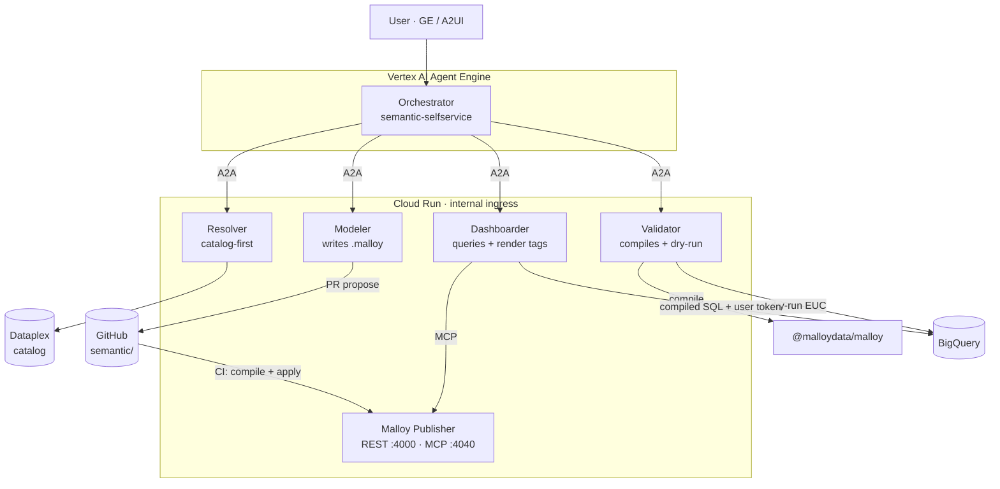
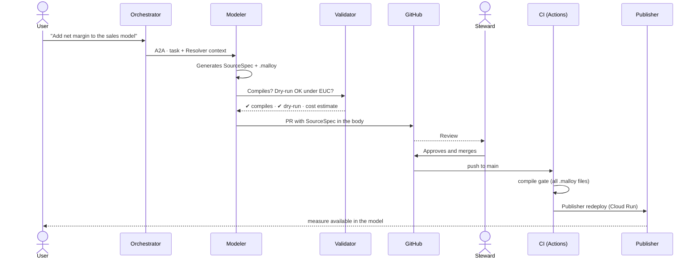
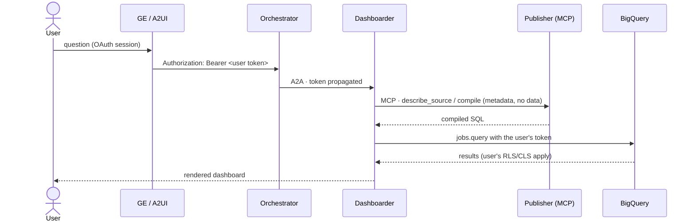

# semantic-selfservice-agents

[Español](README.md) · **English** · [Français](README.fr.md) · [Deutsch](README.de.md) · [Português](README.pt.md)

**Self-service BI agent squad with [Malloy](https://github.com/malloydata/malloy) as the semantic layer, on Google Cloud.**

Git-native variant of [`bi-selfservice-agents`](https://github.com/joseimj/bi-selfservice-agents): same slot in the ecosystem (governed data → dashboards), swapping Looker/LookML for Malloy + Malloy Publisher. Lives alongside [`bq-adhoc-agents`](https://github.com/joseimj/bq-adhoc-agents) (long tail → ephemeral SQL) and [`ds-lab-agents`](https://github.com/joseimj/ds-lab-agents) (inference and prediction).

Built with **Google ADK**, exposed via **A2A** and **A2UI**, orchestrated from **Vertex AI Agent Engine**, with specialists on **Cloud Run** (internal ingress), semantic-model governance through the **propose / approve / apply** pattern over Git, and end-to-end execution under the user's identity (**EUC**).

---

## 1. Why it exists

| Squad | Question it answers | Surface |
|---|---|---|
| **`semantic-selfservice-agents`** | "How much did we sell by region?" (governed, recurring metric) | Malloy dashboards (render tags) served by Publisher |
| `bq-adhoc-agents` | "How many orders used coupon X in March?" (long tail, one-off) | Ephemeral SQL + viz |
| `ds-lab-agents` | "Which customers will churn and why?" (inference, prediction) | Models + scoring + reports |

The thesis holds: **experiment in the long tail, graduate into governance**. What changes is *where* the governed layer lives: instead of a Looker instance with its own API and state, the semantic model is a set of `.malloy` files in this repo. **The repository is the complete source of truth** — there is no external state to keep in sync.

### 1.1 What changes vs. `bi-selfservice-agents`

| Dimension | Looker (original repo) | Malloy (this repo) |
|---|---|---|
| Semantic model | LookML (views/explores) synced to the instance | `.malloy` files (sources/queries) — Git-native |
| Serving | Looker instance + SDK 4.0 | Malloy Publisher on Cloud Run (REST `:4000` + MCP `:4040`) |
| Dashboards | LookML dashboards / UDD via API | One query with `nest:` + render tags (`# dashboard`, `# bar_chart`) — a single text artifact |
| Delivery to the user | Embed SSO URL | Publisher UI, React SDK components, or a `.malloynb` notebook |
| CI validation | `lookml-lint` + instance validator | Deterministic compilation (`@malloydata/malloy`) + BigQuery dry-run |
| EUC | Token dies at the embed SSO | Compiled SQL runs on BQ with the user's OAuth token — one hop fewer |
| Agent interface | Looker SDK (REST) | Publisher's **native MCP** — specialists query the model over MCP |
| Scheduling / alerts | Native in Looker | Cloud Scheduler + `dashboarder` agent (see §9 Roadmap) |

### 1.2 Inherited principles (non-negotiable)

1. **Catalog-first**: the LLM never recalls schemas; it queries Dataplex. Tables, dimensions and metrics are resolved against the catalog before generating any `.malloy`.
2. **Propose / approve / apply**: agents never write directly to the semantic model. They propose a PR with the new or modified `.malloy`; a human steward approves; CI compiles and applies (Publisher redeploy).
3. **End-to-end EUC**: every query runs with the end user's OAuth token. No broad service accounts on the data path.
4. **Specs by reference**: contracts between agents carry URIs (Git paths, table FQNs, PR IDs), never inline data in the context.
5. **AgentCard as the public contract**: the squad publishes its capabilities at `/.well-known/agent-card.json`; the general orchestrator (hub) discovers it there, not via hardcoding.

---

## 2. Architecture




The detail that holds everything together: **Publisher never touches data with its own credentials on the user's path**. Publisher compiles and serves model metadata (via MCP); the *execution* of the compiled SQL is done by the specialist against BigQuery with the user's OAuth token (strict EUC). The BQ connection configured in Publisher is used only by its internal exploration UI for stewards, running under a narrowly scoped read-only service account.

---

## 3. The agents

| Agent | Role | Tools | Writes to |
|---|---|---|---|
| **Orchestrator** | Classifies intent, delegates over A2A, synthesizes | `RemoteA2aAgent` ×4 | — |
| **Resolver** | Resolves business terms → catalog assets | `catalog_client` (Dataplex) | — |
| **Modeler** | Generates/modifies `.malloy` sources; opens PRs | `git_provider`, `malloy_compile` | `semantic/packages/*` (via PR) |
| **Dashboarder** | Generates queries with `nest:` + render tags; delivers dashboards | Publisher MCP, `bq_client` (EUC) | `semantic/packages/*/dashboards/` (via PR) |
| **Validator** | Quality gate: compiles, dry-runs, estimates cost | `malloy_compile`, `bq_client` (EUC) | — |

### 3.1 Routing table (orchestrator's initial prompt)

| Detected intent | Delegates to | Example |
|---|---|---|
| "What does X mean?" / discovery | Resolver | "What sales-by-channel fields do we have?" |
| New metric or dimension in the model | Modeler | "Add net margin as a measure" |
| New or modified dashboard | Dashboarder | "I want a weekly sales board by region" |
| Verification before approval | Validator | (invoked by Modeler/Dashboarder, not by the user) |
| Out of domain | **Bounce to the hub** | "Predict churn" → suggests `ds-lab-agents` |

Inherited bounce protocol: if the question is not in this domain, the orchestrator replies `out_of_domain` with a suggested squad, and the hub re-routes (max. 2 hops).

---

## 4. Contracts

Schemas live in [`docs/contracts/`](docs/contracts/). The two central ones:

### 4.1 `SourceSpec` — proposed change to the semantic model

Produced by the Modeler; travels in the PR body. It describes *what* changes (source, joins, dimensions, measures) with catalog references, plus the resulting `.malloy`. The steward approves the spec, not a cryptic diff.

### 4.2 `DashboardSpec` — declarative dashboard definition

Produced by the Dashboarder. A Malloy dashboard is **a single query** with nested views and render tags — the spec captures the intent (metrics, cuts, filters, viz type per panel) and the final query. Being compilable text, the Validator verifies it without executing it.

Both specs carry references (table FQNs, package path, PR ID), never data results.

---

## 5. Promotion flow (propose / approve / apply)



The structural improvement vs. Looker: **the CI gate is deterministic**. Compiling a `.malloy` requires no live instance or platform credentials — if it compiles in CI, it serves in Publisher.

---

## 6. EUC: the identity chain



Compared to Looker's embed SSO there is **one fewer link** to break: the token travels GE → orchestrator → specialist → BigQuery. The tests in `shared/euc.py` verify that no data path uses Application Default Credentials.

---

## 7. Repository layout

```
semantic-selfservice-agents/
├── README.md · README.en.md · README.fr.md · README.de.md · README.pt.md
├── docs/
│   ├── contracts/            # SourceSpec, DashboardSpec (JSON Schema)
│   ├── adr/                  # 0001: why Malloy and not Looker
│   └── arquitectura(.en).svg # architecture diagram (es/en)
├── orchestrator/             # Root ADK agent (Agent Engine) + AgentCard
├── agents/
│   ├── resolver/             # catalog-first over Dataplex
│   ├── modeler/              # generates .malloy + PR
│   ├── dashboarder/          # nested queries + render tags
│   └── validator/            # compile gate + EUC dry-run
├── publisher/                # Malloy Publisher config and Dockerfile
├── semantic/
│   └── packages/
│       └── ventas/           # sample package (publisher.json + .malloy)
├── shared/                   # euc.py · catalog_client.py · git_provider.py · a2a.py
├── evals/                    # routing golden set + compile gate
├── scripts/                  # compile_gate.mjs (used by CI and Validator)
├── infra/                    # Terraform: Cloud Run ×5, WIF, Artifact Registry
└── .github/workflows/ci.yml  # compile gate + Publisher deploy
```

---

## 8. Deployment

```bash
# 1. Infrastructure
cd infra && terraform init && terraform apply

# 2. Local Publisher (for development)
npx @malloy-publisher/server --port 4000 --server_root semantic/

# 3. Local compile gate (identical to what CI runs)
node scripts/compile_gate.mjs semantic/packages

# 4. Specialists
make deploy-agents   # build + deploy Cloud Run (internal ingress)

# 5. Orchestrator
make deploy-orchestrator   # Vertex AI Agent Engine
```

Cross-squad environment variables: this repo exposes `SEMANTIC_ORCHESTRATOR_URL` (AgentCard at `/.well-known/agent-card.json`) so the hub and sibling squads can discover it.

---

## 9. Roadmap

- [ ] **Scheduling and alerts** — the one thing Looker gave for free. Design: Cloud Scheduler → Dashboarder (saved query) → threshold in `DashboardSpec.alerts[]` → notification.
- [ ] **Caching** — BQ results with `maximum_bytes_billed` + BI Engine; evaluate materialized tables proposed by the Modeler via PR (same governance pattern).
- [ ] **Assisted migration** — an agent that translates existing LookML from `bi-selfservice-agents` into `.malloy` sources (proposes a PR, steward compares).
- [ ] **Embedded Composer** — self-service exploration for business users on the same model.

## 10. Relationship with the sibling squads

The triangle still closes: *"predict churn and put the result in a weekly dashboard"* → the hub sequences `ds-lab-agents` (scoring into a BQ table) → this squad (Modeler adds the source, Dashboarder builds the board). The hub's `PlanSpec` references the scoring table's FQN; nothing travels inline.

---

## Author

**Jose Maldonado** ([@joseimj](https://github.com/joseimj)) — also the author of the sibling systems [`bi-selfservice-agents`](https://github.com/joseimj/bi-selfservice-agents), [`bq-adhoc-agents`](https://github.com/joseimj/bq-adhoc-agents) and [`ds-lab-agents`](https://github.com/joseimj/ds-lab-agents).
