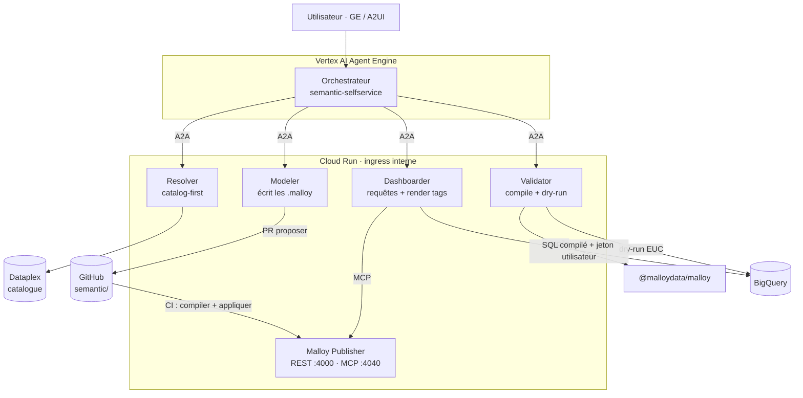
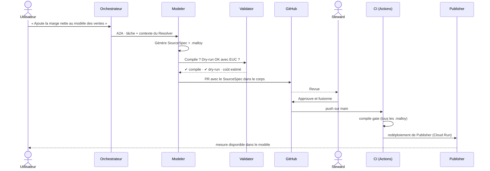
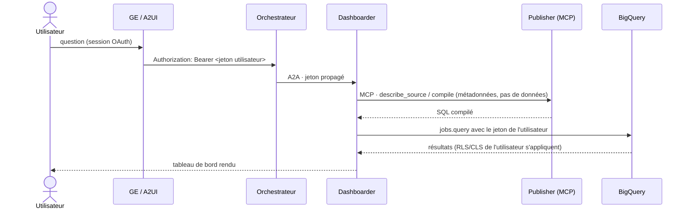

# semantic-selfservice-agents

[Español](README.md) · [English](README.en.md) · **Français** · [Deutsch](README.de.md) · [Português](README.pt.md)

**Escouade d'agents de BI en libre-service avec [Malloy](https://github.com/malloydata/malloy) comme couche sémantique, sur Google Cloud.**

Variante Git-native de [`bi-selfservice-agents`](https://github.com/joseimj/bi-selfservice-agents) : même rôle dans l'écosystème (donnée gouvernée → tableaux de bord), en remplaçant Looker/LookML par Malloy + Malloy Publisher. Coexiste avec [`bq-adhoc-agents`](https://github.com/joseimj/bq-adhoc-agents) (longue traîne → SQL éphémère) et [`ds-lab-agents`](https://github.com/joseimj/ds-lab-agents) (inférence et prédiction).

Construit avec **Google ADK**, exposé via **A2A** et **A2UI**, orchestré depuis **Vertex AI Agent Engine**, avec des spécialistes sur **Cloud Run** (ingress interne), la gouvernance du modèle sémantique via le patron **proposer / approuver / appliquer** sur Git, et l'exécution avec l'identité de l'utilisateur (**EUC**) de bout en bout.

---

## 1. Pourquoi ce projet existe

| Escouade | Question traitée | Surface |
|---|---|---|
| **`semantic-selfservice-agents`** | « Combien avons-nous vendu par région ? » (métrique gouvernée, récurrente) | Tableaux de bord Malloy (render tags) servis par Publisher |
| `bq-adhoc-agents` | « Combien de commandes avec le coupon X en mars ? » (longue traîne, ponctuel) | SQL éphémère + visualisation |
| `ds-lab-agents` | « Quels clients vont résilier et pourquoi ? » (inférence, prédiction) | Modèles + scoring + rapports |

La thèse reste la même : **expérimenter dans la longue traîne, graduer vers le gouverné**. Ce qui change, c'est *où vit* le gouverné : au lieu d'une instance Looker avec son API et son état propre, le modèle sémantique est un ensemble de fichiers `.malloy` dans ce dépôt. **Le dépôt est la source de vérité complète** — il n'y a aucun état externe à synchroniser.

### 1.1 Ce qui change par rapport à `bi-selfservice-agents`

| Dimension | Looker (dépôt d'origine) | Malloy (ce dépôt) |
|---|---|---|
| Modèle sémantique | LookML (views/explores) synchronisé avec l'instance | Fichiers `.malloy` (sources/queries) — Git-natif |
| Service | Instance Looker + SDK 4.0 | Malloy Publisher sur Cloud Run (REST `:4000` + MCP `:4040`) |
| Tableaux de bord | LookML dashboards / UDD via API | Une requête avec `nest:` + render tags (`# dashboard`, `# bar_chart`) — un seul artefact texte |
| Livraison à l'utilisateur | URL embed SSO | UI de Publisher, composants React du SDK, ou notebook `.malloynb` |
| Validation en CI | `lookml-lint` + validateur de l'instance | Compilation déterministe (`@malloydata/malloy`) + dry-run BigQuery |
| EUC | Le jeton meurt à l'embed SSO | Le SQL compilé s'exécute sur BQ avec le jeton OAuth de l'utilisateur — un saut de moins |
| Interface pour agents | Looker SDK (REST) | **MCP natif** de Publisher — les spécialistes interrogent le modèle via MCP |
| Planification / alertes | Natif dans Looker | Cloud Scheduler + agent `dashboarder` (voir §9 Feuille de route) |

### 1.2 Principes hérités (non négociables)

1. **Catalog-first** : le LLM ne se souvient jamais des schémas ; il interroge Dataplex. Tables, dimensions et métriques sont résolues contre le catalogue avant de générer le moindre `.malloy`.
2. **Proposer / approuver / appliquer** : les agents n'écrivent jamais directement dans le modèle sémantique. Ils proposent une PR avec le `.malloy` nouveau ou modifié ; un steward humain approuve ; la CI compile et applique (redéploiement de Publisher).
3. **EUC de bout en bout** : chaque requête s'exécute avec le jeton OAuth de l'utilisateur final. Aucun service account à large portée sur le chemin des données.
4. **Specs par référence** : les contrats entre agents transportent des URI (chemins Git, FQN de tables, IDs de PR), jamais de données inline dans le contexte.
5. **AgentCard comme contrat public** : l'escouade publie ses capacités sur `/.well-known/agent-card.json` ; l'orchestrateur général (hub) la découvre par là, pas en dur.

---

## 2. Architecture




Le détail qui tient tout l'édifice : **Publisher ne touche jamais aux données avec ses propres identifiants sur le chemin de l'utilisateur**. Publisher compile et sert les métadonnées du modèle (via MCP) ; l'*exécution* du SQL compilé est faite par le spécialiste contre BigQuery avec le jeton OAuth de l'utilisateur (EUC strict). La connexion BQ configurée dans Publisher ne sert qu'à son UI d'exploration interne pour les stewards, avec un service account en lecture seule à portée restreinte.

---

## 3. Les agents

| Agent | Rôle | Outils | Écrit dans |
|---|---|---|---|
| **Orchestrateur** | Classe l'intention, délègue via A2A, synthétise | `RemoteA2aAgent` ×4 | — |
| **Resolver** | Résout les termes métier → actifs du catalogue | `catalog_client` (Dataplex) | — |
| **Modeler** | Génère/modifie les sources `.malloy` ; ouvre des PR | `git_provider`, `malloy_compile` | `semantic/packages/*` (via PR) |
| **Dashboarder** | Génère des requêtes avec `nest:` + render tags ; livre le tableau de bord | MCP de Publisher, `bq_client` (EUC) | `semantic/packages/*/dashboards/` (via PR) |
| **Validator** | Barrière de qualité : compile, dry-run, estime le coût | `malloy_compile`, `bq_client` (EUC) | — |

### 3.1 Table de routage (prompt initial de l'orchestrateur)

| Intention détectée | Délègue à | Exemple |
|---|---|---|
| « Que signifie X ? » / découverte | Resolver | « Quels champs de ventes par canal avons-nous ? » |
| Métrique ou dimension nouvelle dans le modèle | Modeler | « Ajoute la marge nette comme mesure » |
| Tableau de bord nouveau ou modifié | Dashboarder | « Je veux un tableau hebdomadaire des ventes par région » |
| Vérification avant approbation | Validator | (invoqué par Modeler/Dashboarder, pas par l'utilisateur) |
| Hors domaine | **Renvoi au hub** | « Prédis le churn » → suggère `ds-lab-agents` |

Protocole de renvoi hérité : si la question n'appartient pas à ce domaine, l'orchestrateur répond `out_of_domain` avec l'escouade suggérée, et le hub redirige (max. 2 sauts).

---

## 4. Contrats

Les schémas vivent dans [`docs/contracts/`](docs/contracts/). Les deux centraux :

### 4.1 `SourceSpec` — proposition de changement au modèle sémantique

Produit par le Modeler ; voyage dans le corps de la PR. Il décrit *ce qui* change (source, joins, dimensions, mesures) avec des références au catalogue, et le `.malloy` résultant. Le steward approuve le spec, pas un diff cryptique.

### 4.2 `DashboardSpec` — définition déclarative d'un tableau de bord

Produit par le Dashboarder. Un tableau de bord Malloy est **une seule requête** avec des vues imbriquées et des render tags — le spec capture l'intention (métriques, découpes, filtres, type de visualisation par panneau) et la requête finale. Étant du texte compilable, le Validator le vérifie sans l'exécuter.

Les deux specs transportent des références (FQN de tables, chemin du package, ID de PR), jamais de résultats de données.

---

## 5. Flux de promotion (proposer / approuver / appliquer)



L'amélioration structurelle par rapport à Looker : **la barrière de la CI est déterministe**. Compiler un `.malloy` n'exige ni instance vivante ni identifiants de plateforme — s'il compile en CI, il est servi par Publisher.

---

## 6. EUC : la chaîne d'identité



Comparé à l'embed SSO de Looker, il y a ici **un maillon de moins** à casser : le jeton voyage GE → orchestrateur → spécialiste → BigQuery. Les tests de `shared/euc.py` vérifient qu'aucun chemin de données n'utilise les Application Default Credentials.

---

## 7. Structure du dépôt

```
semantic-selfservice-agents/
├── README.md · README.en.md · README.fr.md · README.de.md · README.pt.md
├── docs/
│   ├── contracts/            # SourceSpec, DashboardSpec (JSON Schema)
│   ├── adr/                  # 0001 : pourquoi Malloy et pas Looker
│   └── arquitectura(.en).svg # diagramme d'architecture (es/en)
├── orchestrator/             # Agent racine ADK (Agent Engine) + AgentCard
├── agents/
│   ├── resolver/             # catalog-first sur Dataplex
│   ├── modeler/              # génère les .malloy + PR
│   ├── dashboarder/          # requêtes imbriquées + render tags
│   └── validator/            # compile gate + dry-run EUC
├── publisher/                # config et Dockerfile de Malloy Publisher
├── semantic/
│   └── packages/
│       └── ventas/           # package d'exemple (publisher.json + .malloy)
├── shared/                   # euc.py · catalog_client.py · git_provider.py · a2a.py
├── evals/                    # golden set de routage + compile gate
├── scripts/                  # compile_gate.mjs (utilisé par la CI et le Validator)
├── infra/                    # Terraform : Cloud Run ×5, WIF, Artifact Registry
└── .github/workflows/ci.yml  # compile gate + déploiement de Publisher
```

---

## 8. Déploiement

```bash
# 1. Infrastructure
cd infra && terraform init && terraform apply

# 2. Publisher en local (pour le développement)
npx @malloy-publisher/server --port 4000 --server_root semantic/

# 3. Compile gate en local (identique à ce que la CI exécute)
node scripts/compile_gate.mjs semantic/packages

# 4. Spécialistes
make deploy-agents   # build + déploiement Cloud Run (ingress interne)

# 5. Orchestrateur
make deploy-orchestrator   # Vertex AI Agent Engine
```

Variables d'environnement croisées avec les escouades sœurs : ce dépôt expose `SEMANTIC_ORCHESTRATOR_URL` (AgentCard sur `/.well-known/agent-card.json`) pour que le hub et les escouades sœurs le découvrent.

---

## 9. Feuille de route

- [ ] **Planification et alertes** — la seule chose que Looker offrait gratuitement. Conception : Cloud Scheduler → Dashboarder (requête sauvegardée) → seuil dans `DashboardSpec.alerts[]` → notification.
- [ ] **Caching** — résultats BQ avec `maximum_bytes_billed` + BI Engine ; évaluer des tables matérialisées proposées par le Modeler via PR (même patron de gouvernance).
- [ ] **Migration assistée** — un agent qui traduit le LookML existant de `bi-selfservice-agents` en sources `.malloy` (propose une PR, le steward compare).
- [ ] **Composer intégré** — exploration en libre-service pour les utilisateurs métier sur le même modèle.

## 10. Relation avec les escouades sœurs

Le triangle se referme toujours : *« prédis le churn et mets le résultat dans un tableau de bord hebdomadaire »* → le hub séquence `ds-lab-agents` (scoring vers une table BQ) → cette escouade (le Modeler ajoute la source, le Dashboarder construit le tableau). Le `PlanSpec` du hub référence le FQN de la table de scoring ; rien ne voyage inline.

---

## Auteur

**Jose Maldonado** ([@joseimj](https://github.com/joseimj)) — également auteur des systèmes sœurs [`bi-selfservice-agents`](https://github.com/joseimj/bi-selfservice-agents), [`bq-adhoc-agents`](https://github.com/joseimj/bq-adhoc-agents) et [`ds-lab-agents`](https://github.com/joseimj/ds-lab-agents).
