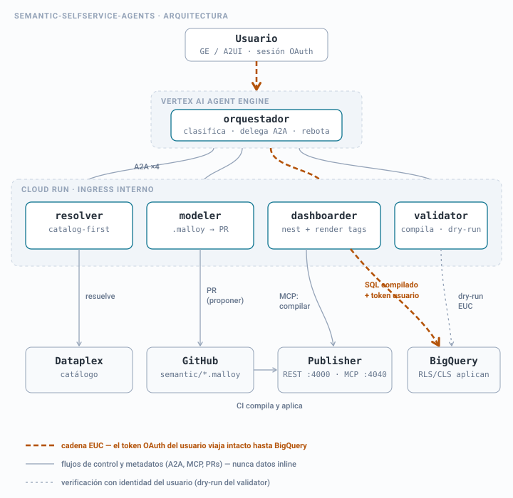
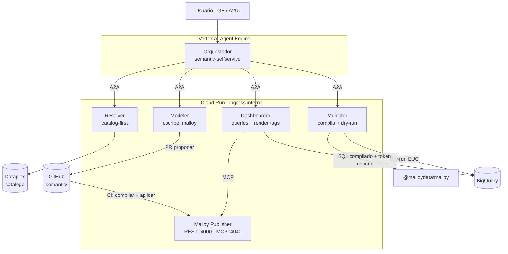
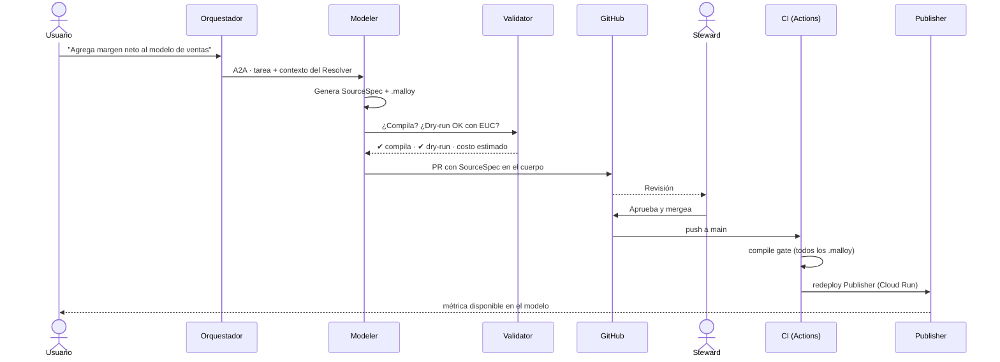
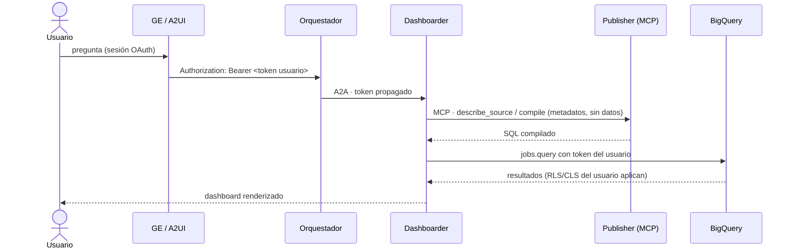

# semantic-selfservice-agents

**Español** · [English](README.en.md) · [Français](README.fr.md) · [Deutsch](README.de.md) · [Português](README.pt.md)

**Cuadrilla de agentes de BI self-service con [Malloy](https://github.com/malloydata/malloy) como capa semántica, sobre Google Cloud.**

Variante Git-nativa de [`bi-selfservice-agents`](https://github.com/joseimj/bi-selfservice-agents): mismo slot en el ecosistema (dato gobernado → dashboards), pero reemplazando Looker/LookML por Malloy + Malloy Publisher. Convive con [`bq-adhoc-agents`](https://github.com/joseimj/bq-adhoc-agents) (larga cola → SQL efímero) y [`ds-lab-agents`](https://github.com/joseimj/ds-lab-agents) (inferencia y predicción).

Construida con **Google ADK**, expuesta vía **A2A** y **A2UI**, orquestada desde **Vertex AI Agent Engine**, con especialistas en **Cloud Run** (ingress interno), gobierno del modelo semántico mediante el patrón **proponer / aprobar / aplicar** sobre Git, y ejecución con la identidad del usuario (**EUC**) de punta a punta.

---

## 1. Por qué existe

| Cuadrilla | Pregunta que responde | Superficie |
|---|---|---|
| **`semantic-selfservice-agents`** | "¿Cuánto vendimos por región?" (métrica gobernada, recurrente) | Dashboards Malloy (render tags) servidos por Publisher |
| `bq-adhoc-agents` | "¿Cuántos pedidos con cupón X en marzo?" (larga cola, una sola vez) | SQL efímero + viz |
| `ds-lab-agents` | "¿Qué clientes van a cancelar y por qué?" (inferencia, predicción) | Modelos + scoring + reportes |

La tesis se mantiene: **experimentar en la larga cola, graduar hacia lo gobernado**. Lo que cambia es *dónde vive* lo gobernado: en vez de una instancia de Looker con su API y su estado propio, el modelo semántico son archivos `.malloy` en este repo. **El repositorio es la fuente de verdad completa** — no hay estado que sincronizar con una instancia externa.

### 1.1 Qué cambia respecto a `bi-selfservice-agents`

| Dimensión | Looker (repo original) | Malloy (este repo) |
|---|---|---|
| Modelo semántico | LookML (views/explores) sincronizado con la instancia | Archivos `.malloy` (sources/queries) — Git-nativo |
| Servicio | Instancia Looker + SDK 4.0 | Malloy Publisher en Cloud Run (REST `:4000` + MCP `:4040`) |
| Dashboards | LookML dashboards / UDD vía API | Query con `nest:` + tags de render (`# dashboard`, `# bar_chart`) — un artefacto de texto |
| Entrega al usuario | Embed SSO URL | Publisher UI, componentes React del SDK, o notebook `.malloynb` |
| Validación en CI | `lookml-lint` + validador de la instancia | Compilación determinística (`@malloydata/malloy`) + dry-run en BigQuery |
| EUC | Token muere en el embed SSO | El SQL compilado se ejecuta en BQ con el token OAuth del usuario — un hop menos |
| Interfaz para agentes | Looker SDK (REST) | **MCP nativo** de Publisher — los especialistas consultan el modelo por MCP |
| Scheduling / alertas | Nativo de Looker | Cloud Scheduler + agente `dashboarder` (ver §9 Roadmap) |

### 1.2 Principios heredados (no negociables)

1. **Catalog-first**: el LLM nunca recuerda esquemas; los consulta en Dataplex. Tablas, dimensiones y métricas se resuelven contra el catálogo antes de generar cualquier `.malloy`.
2. **Proponer / aprobar / aplicar**: los agentes nunca escriben directo al modelo semántico. Proponen un PR con el `.malloy` nuevo o modificado; un steward humano aprueba; el CI compila y aplica (redeploy de Publisher).
3. **EUC de punta a punta**: toda query corre con el token OAuth del usuario final. Sin service accounts amplias en el camino de datos.
4. **Specs por referencia**: los contratos entre agentes transportan URIs (rutas Git, FQNs de tablas, IDs de PR), nunca datos inline en el contexto.
5. **AgentCard como contrato público**: la cuadrilla publica sus capacidades en `/.well-known/agent-card.json`; el orquestador general (hub) la descubre por ahí, no por hardcode.

---

## 2. Arquitectura





El detalle que sostiene todo: **Publisher nunca toca datos con credenciales propias en el camino del usuario**. Publisher compila y sirve metadatos del modelo (vía MCP); la *ejecución* del SQL compilado la hace el especialista contra BigQuery con el token OAuth del usuario (EUC estricto). La conexión BQ configurada en Publisher solo se usa para su UI de exploración interna de stewards, y corre con una service account de solo-lectura acotada.

---

## 3. Los agentes

| Agente | Rol | Herramientas | Escribe en |
|---|---|---|---|
| **Orquestador** | Clasifica intención, delega vía A2A, sintetiza | `RemoteA2aAgent` ×4 | — |
| **Resolver** | Resuelve términos de negocio → activos del catálogo | `catalog_client` (Dataplex) | — |
| **Modeler** | Genera/modifica sources `.malloy`; abre PR | `git_provider`, `malloy_compile` | `semantic/packages/*` (vía PR) |
| **Dashboarder** | Genera queries con `nest:` + tags de render; entrega dashboard | MCP de Publisher, `bq_client` (EUC) | `semantic/packages/*/dashboards/` (vía PR) |
| **Validator** | Gate de calidad: compila, dry-run, estima costo | `malloy_compile`, `bq_client` (EUC) | — |

### 3.1 Tabla de routing (prompt inicial del orquestador)

| Intención detectada | Delega a | Ejemplo |
|---|---|---|
| "¿Qué significa X?" / descubrimiento | Resolver | "¿Qué campos hay de ventas por canal?" |
| Métrica o dimensión nueva en el modelo | Modeler | "Agrega margen neto como métrica" |
| Dashboard nuevo o modificado | Dashboarder | "Quiero un tablero de ventas semanales por región" |
| Verificación antes de aprobar | Validator | (invocado por Modeler/Dashboarder, no por el usuario) |
| Fuera de dominio | **Rebote al hub** | "Predice el churn" → sugiere `ds-lab-agents` |

Protocolo de rebote heredado: si la pregunta no es de este dominio, el orquestador responde `out_of_domain` con sugerencia de cuadrilla, y el hub re-rutea (máx. 2 saltos).

---

## 4. Contratos

Los schemas viven en [`docs/contracts/`](docs/contracts/). Los dos centrales:

### 4.1 `SourceSpec` — propuesta de cambio al modelo semántico

Lo produce el Modeler; viaja en el cuerpo del PR. Describe *qué* cambia (source, joins, dimensiones, medidas) con referencias al catálogo, y el `.malloy` resultante. El steward aprueba el spec, no un diff críptico.

### 4.2 `DashboardSpec` — definición declarativa de un dashboard

Lo produce el Dashboarder. Un dashboard Malloy es **un solo query** con vistas anidadas y tags de render — el spec captura la intención (métricas, cortes, filtros, tipo de viz por panel) y el query final. Al ser texto compilable, el Validator lo verifica sin ejecutarlo.

Ambos specs transportan referencias (FQN de tablas, ruta del package, ID de PR), nunca resultados de datos.

---

## 5. Flujo de promoción (proponer / aprobar / aplicar)



La mejora estructural vs Looker: **el gate del CI es determinístico**. Compilar un `.malloy` no requiere instancia viva ni credenciales de plataforma — si compila en CI, sirve en Publisher.

---

## 6. EUC: la cadena de identidad



Comparado con el embed SSO de Looker, aquí hay **un eslabón menos** que romper: el token viaja GE → orquestador → especialista → BigQuery. Los tests de `shared/euc.py` verifican que ningún camino de datos use Application Default Credentials.

---

## 7. Estructura del repo

```
semantic-selfservice-agents/
├── README.md · README.en.md · README.fr.md · README.de.md · README.pt.md
├── docs/
│   ├── contracts/            # SourceSpec, DashboardSpec (JSON Schema)
│   ├── adr/                  # 0001: por qué Malloy y no Looker
│   └── arquitectura(.en).svg # diagrama de arquitectura (es/en)
├── orchestrator/             # Agente raíz ADK (Agent Engine) + AgentCard
├── agents/
│   ├── resolver/             # catalog-first sobre Dataplex
│   ├── modeler/              # genera .malloy + PR
│   ├── dashboarder/          # queries anidados + render tags
│   └── validator/            # compile gate + dry-run EUC
├── publisher/                # config y Dockerfile de Malloy Publisher
├── semantic/
│   └── packages/
│       └── ventas/           # package de ejemplo (publisher.json + .malloy)
├── shared/                   # euc.py · catalog_client.py · git_provider.py · a2a.py
├── evals/                    # golden set de routing + gate de compilación
├── scripts/                  # compile_gate.mjs (usado por CI y Validator)
├── infra/                    # Terraform: Cloud Run ×5, WIF, Artifact Registry
└── .github/workflows/ci.yml  # compile gate + deploy Publisher
```

---

## 8. Despliegue

```bash
# 1. Infraestructura
cd infra && terraform init && terraform apply

# 2. Publisher local (para desarrollo)
npx @malloy-publisher/server --port 4000 --server_root semantic/

# 3. Compile gate local (lo mismo que corre el CI)
node scripts/compile_gate.mjs semantic/packages

# 4. Especialistas
make deploy-agents   # build + deploy Cloud Run (ingress interno)

# 5. Orquestador
make deploy-orchestrator   # Vertex AI Agent Engine
```

Variables de entorno cruzadas con las cuadrillas hermanas: este repo expone `SEMANTIC_ORCHESTRATOR_URL` (AgentCard en `/.well-known/agent-card.json`) para que el hub y los hermanos lo descubran.

---

## 9. Roadmap

- [ ] **Scheduling y alertas** — lo único que Looker daba gratis. Diseño: Cloud Scheduler → Dashboarder (query guardado) → umbral en `DashboardSpec.alerts[]` → notificación. 
- [ ] **Caching** — resultados BQ con `maximum_bytes_billed` + BI Engine; evaluar tablas materializadas propuestas por el Modeler vía PR (mismo patrón de gobierno).
- [ ] **Migración asistida** — agente que traduce LookML existente de `bi-selfservice-agents` a sources `.malloy` (propone PR, steward compara).
- [ ] **Composer embebido** — exploración self-service para usuarios de negocio sobre el mismo modelo.

## 10. Relación con las cuadrillas hermanas

El cierre del triángulo se mantiene: *"predice churn y ponme el resultado en un dashboard semanal"* → el hub secuencia `ds-lab-agents` (scoring a tabla BQ) → esta cuadrilla (Modeler agrega el source, Dashboarder arma el tablero). El `PlanSpec` del hub referencia el FQN de la tabla de scoring; nada viaja inline.
