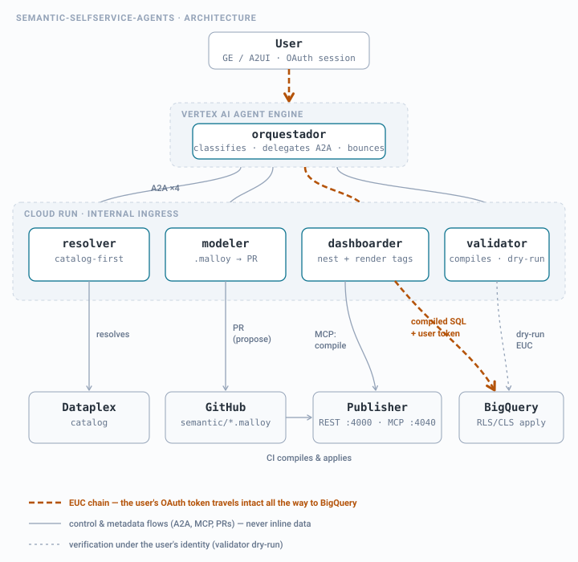
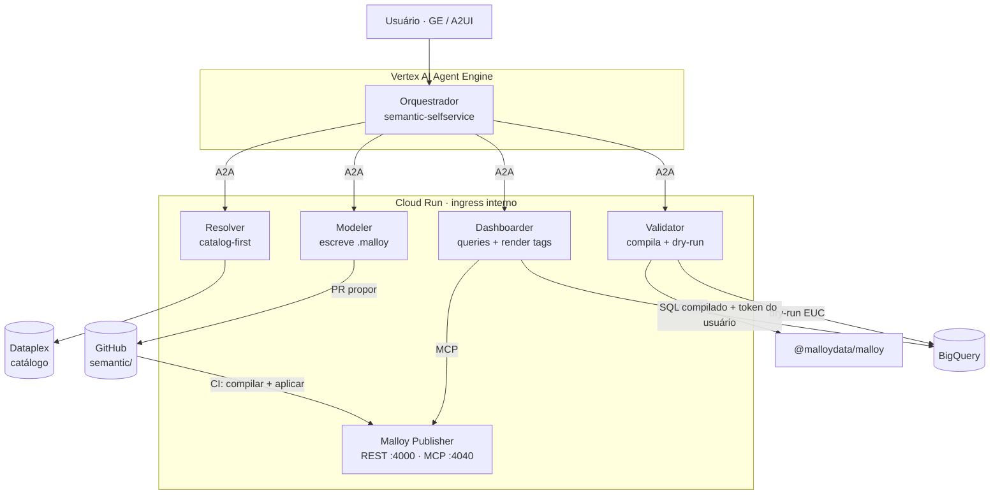
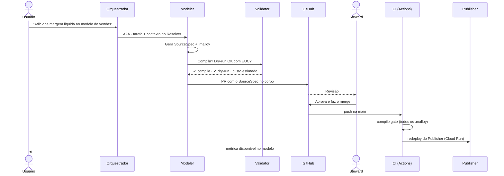
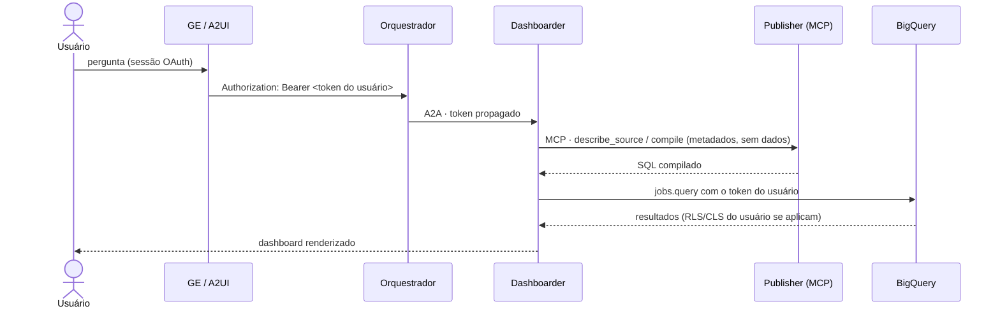

# semantic-selfservice-agents

[Español](README.md) · [English](README.en.md) · [Français](README.fr.md) · [Deutsch](README.de.md) · **Português**

**Esquadrão de agentes de BI self-service com [Malloy](https://github.com/malloydata/malloy) como camada semântica, no Google Cloud.**

Construído com **Google ADK**, exposto via **A2A** e **A2UI**, orquestrado a partir do **Vertex AI Agent Engine**, com especialistas no **Cloud Run** (ingress interno), governança do modelo semântico pelo padrão **propor / aprovar / aplicar** sobre Git, e execução com a identidade do usuário (**EUC**) de ponta a ponta.

---

## 1. Por que ele existe

| Esquadrão | Pergunta que responde | Superfície |
|---|---|---|
| **`semantic-selfservice-agents`** | "Quanto vendemos por região?" (métrica governada, recorrente) | Dashboards Malloy (render tags) servidos pelo Publisher |
| `bq-adhoc-agents` | "Quantos pedidos com o cupom X em março?" (cauda longa, pontual) | SQL efêmero + visualização |
| `ds-lab-agents` | "Quais clientes vão cancelar e por quê?" (inferência, predição) | Modelos + scoring + relatórios |

A tese se mantém: **experimentar na cauda longa, graduar para o governado**. O que muda é *onde vive* o governado: em vez de uma instância Looker com sua API e seu estado próprio, o modelo semântico é um conjunto de arquivos `.malloy` neste repositório. **O repositório é a fonte de verdade completa** — não há estado externo para sincronizar.

### 1.1 O que muda em relação ao `bi-selfservice-agents`

| Dimensão | Looker (repo original) | Malloy (este repo) |
|---|---|---|
| Modelo semântico | LookML (views/explores) sincronizado com a instância | Arquivos `.malloy` (sources/queries) — Git-nativo |
| Serviço | Instância Looker + SDK 4.0 | Malloy Publisher no Cloud Run (REST `:4000` + MCP `:4040`) |
| Dashboards | LookML dashboards / UDD via API | Uma query com `nest:` + render tags (`# dashboard`, `# bar_chart`) — um único artefato de texto |
| Entrega ao usuário | URL de embed SSO | UI do Publisher, componentes React do SDK, ou notebook `.malloynb` |
| Validação no CI | `lookml-lint` + validador da instância | Compilação determinística (`@malloydata/malloy`) + dry-run no BigQuery |
| EUC | O token morre no embed SSO | O SQL compilado roda no BQ com o token OAuth do usuário — um salto a menos |
| Interface para agentes | Looker SDK (REST) | **MCP nativo** do Publisher — os especialistas consultam o modelo por MCP |
| Agendamento / alertas | Nativo do Looker | Cloud Scheduler + agente `dashboarder` (ver §9 Roadmap) |

### 1.2 Princípios herdados (não negociáveis)

1. **Catalog-first**: o LLM nunca lembra esquemas; ele consulta o Dataplex. Tabelas, dimensões e métricas são resolvidas contra o catálogo antes de gerar qualquer `.malloy`.
2. **Propor / aprovar / aplicar**: os agentes nunca escrevem direto no modelo semântico. Eles propõem um PR com o `.malloy` novo ou modificado; um steward humano aprova; o CI compila e aplica (redeploy do Publisher).
3. **EUC de ponta a ponta**: toda query roda com o token OAuth do usuário final. Sem service accounts amplas no caminho dos dados.
4. **Specs por referência**: os contratos entre agentes transportam URIs (caminhos Git, FQNs de tabelas, IDs de PR), nunca dados inline no contexto.
5. **AgentCard como contrato público**: o esquadrão publica suas capacidades em `/.well-known/agent-card.json`; o orquestrador geral (hub) o descobre por ali, não por hardcode.

---

## 2. Arquitetura





O detalhe que sustenta tudo: **o Publisher nunca toca dados com credenciais próprias no caminho do usuário**. O Publisher compila e serve metadados do modelo (via MCP); a *execução* do SQL compilado é feita pelo especialista contra o BigQuery com o token OAuth do usuário (EUC estrito). A conexão BQ configurada no Publisher serve apenas à sua UI de exploração interna para stewards, com uma service account somente-leitura de escopo restrito.

---

## 3. Os agentes

| Agente | Papel | Ferramentas | Escreve em |
|---|---|---|---|
| **Orquestrador** | Classifica a intenção, delega via A2A, sintetiza | `RemoteA2aAgent` ×4 | — |
| **Resolver** | Resolve termos de negócio → ativos do catálogo | `catalog_client` (Dataplex) | — |
| **Modeler** | Gera/modifica sources `.malloy`; abre PRs | `git_provider`, `malloy_compile` | `semantic/packages/*` (via PR) |
| **Dashboarder** | Gera queries com `nest:` + render tags; entrega o dashboard | MCP do Publisher, `bq_client` (EUC) | `semantic/packages/*/dashboards/` (via PR) |
| **Validator** | Portão de qualidade: compila, dry-run, estima custo | `malloy_compile`, `bq_client` (EUC) | — |

### 3.1 Tabela de roteamento (prompt inicial do orquestrador)

| Intenção detectada | Delega para | Exemplo |
|---|---|---|
| "O que significa X?" / descoberta | Resolver | "Quais campos de vendas por canal temos?" |
| Métrica ou dimensão nova no modelo | Modeler | "Adicione margem líquida como métrica" |
| Dashboard novo ou modificado | Dashboarder | "Quero um painel semanal de vendas por região" |
| Verificação antes da aprovação | Validator | (invocado por Modeler/Dashboarder, não pelo usuário) |
| Fora do domínio | **Devolução ao hub** | "Preveja o churn" → sugere `ds-lab-agents` |

Protocolo de devolução herdado: se a pergunta não é deste domínio, o orquestrador responde `out_of_domain` com o esquadrão sugerido, e o hub redireciona (máx. 2 saltos).

---

## 4. Contratos

Os schemas vivem em [`docs/contracts/`](docs/contracts/). Os dois centrais:

### 4.1 `SourceSpec` — proposta de mudança no modelo semântico

Produzido pelo Modeler; viaja no corpo do PR. Descreve *o que* muda (source, joins, dimensões, medidas) com referências ao catálogo, e o `.malloy` resultante. O steward aprova o spec, não um diff críptico.

### 4.2 `DashboardSpec` — definição declarativa de um dashboard

Produzido pelo Dashboarder. Um dashboard Malloy é **uma única query** com vistas aninhadas e render tags — o spec captura a intenção (métricas, cortes, filtros, tipo de visualização por painel) e a query final. Por ser texto compilável, o Validator o verifica sem executá-lo.

Ambos os specs transportam referências (FQNs de tabelas, caminho do package, ID do PR), nunca resultados de dados.

---

## 5. Fluxo de promoção (propor / aprovar / aplicar)



A melhoria estrutural em relação ao Looker: **o portão do CI é determinístico**. Compilar um `.malloy` não exige instância viva nem credenciais de plataforma — se compila no CI, é servido pelo Publisher.

---

## 6. EUC: a cadeia de identidade



Comparado ao embed SSO do Looker, aqui há **um elo a menos** para quebrar: o token viaja GE → orquestrador → especialista → BigQuery. Os testes de `shared/euc.py` verificam que nenhum caminho de dados usa Application Default Credentials.

---

## 7. Estrutura do repositório

```
semantic-selfservice-agents/
├── README.md · README.en.md · README.fr.md · README.de.md · README.pt.md
├── docs/
│   ├── contracts/            # SourceSpec, DashboardSpec (JSON Schema)
│   ├── adr/                  # 0001: por que Malloy e não Looker
│   └── arquitectura(.en).svg # diagrama de arquitetura (es/en)
├── orchestrator/             # Agente raiz ADK (Agent Engine) + AgentCard
├── agents/
│   ├── resolver/             # catalog-first sobre o Dataplex
│   ├── modeler/              # gera .malloy + PR
│   ├── dashboarder/          # queries aninhadas + render tags
│   └── validator/            # compile gate + dry-run EUC
├── publisher/                # config e Dockerfile do Malloy Publisher
├── semantic/
│   └── packages/
│       └── ventas/           # package de exemplo (publisher.json + .malloy)
├── shared/                   # euc.py · catalog_client.py · git_provider.py · a2a.py
├── evals/                    # golden set de roteamento + compile gate
├── scripts/                  # compile_gate.mjs (usado pelo CI e pelo Validator)
├── infra/                    # Terraform: Cloud Run ×5, WIF, Artifact Registry
└── .github/workflows/ci.yml  # compile gate + deploy do Publisher
```

---

## 8. Implantação

```bash
# 1. Infraestrutura
cd infra && terraform init && terraform apply

# 2. Publisher local (para desenvolvimento)
npx @malloy-publisher/server --port 4000 --server_root semantic/

# 3. Compile gate local (idêntico ao que o CI executa)
node scripts/compile_gate.mjs semantic/packages

# 4. Especialistas
make deploy-agents   # build + deploy Cloud Run (ingress interno)

# 5. Orquestrador
make deploy-orchestrator   # Vertex AI Agent Engine
```

Variáveis de ambiente cruzadas com os esquadrões irmãos: este repo expõe `SEMANTIC_ORCHESTRATOR_URL` (AgentCard em `/.well-known/agent-card.json`) para que o hub e os irmãos o descubram.

---

## 9. Roadmap

- [ ] **Agendamento e alertas** — a única coisa que o Looker dava de graça. Desenho: Cloud Scheduler → Dashboarder (query salva) → limiar em `DashboardSpec.alerts[]` → notificação.
- [ ] **Caching** — resultados BQ com `maximum_bytes_billed` + BI Engine; avaliar tabelas materializadas propostas pelo Modeler via PR (mesmo padrão de governança).
- [ ] **Migração assistida** — agente que traduz o LookML existente do `bi-selfservice-agents` para sources `.malloy` (propõe um PR, o steward compara).
- [ ] **Composer embutido** — exploração self-service para usuários de negócio sobre o mesmo modelo.

## 10. Relação com os esquadrões irmãos

O fechamento do triângulo se mantém: *"preveja o churn e coloque o resultado num dashboard semanal"* → o hub sequencia o `ds-lab-agents` (scoring para uma tabela BQ) → este esquadrão (o Modeler adiciona o source, o Dashboarder monta o painel). O `PlanSpec` do hub referencia o FQN da tabela de scoring; nada viaja inline.

---

## Autor
